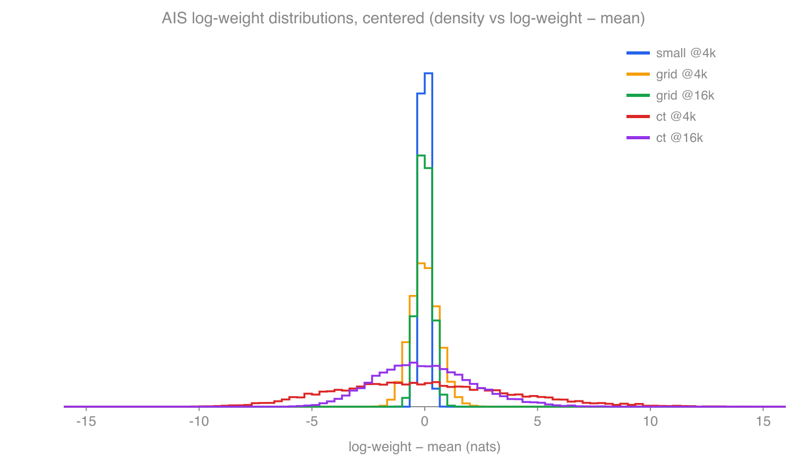
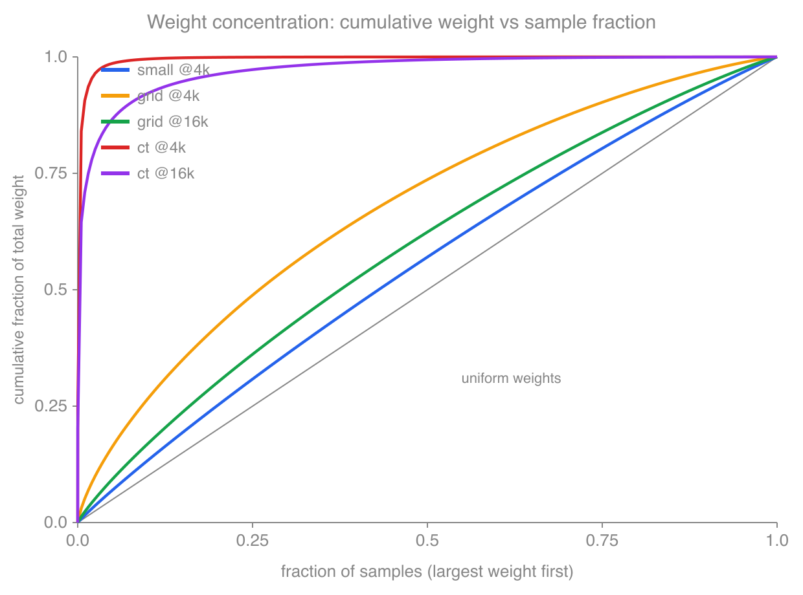
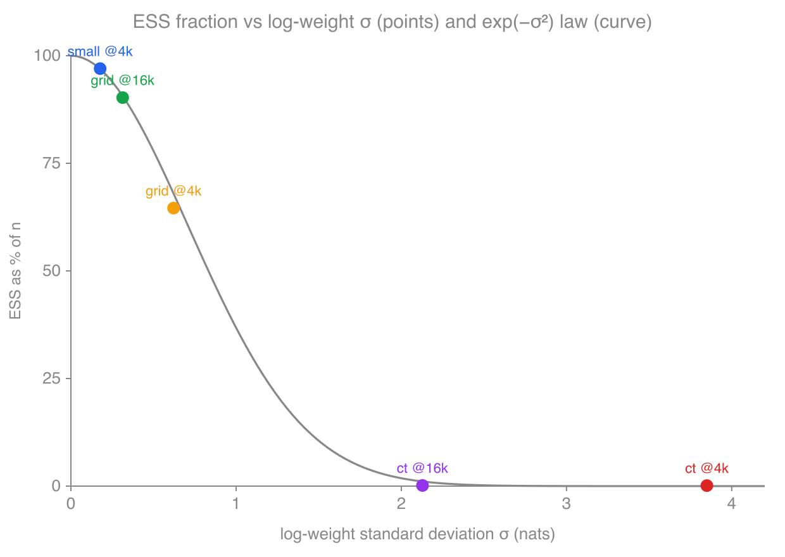
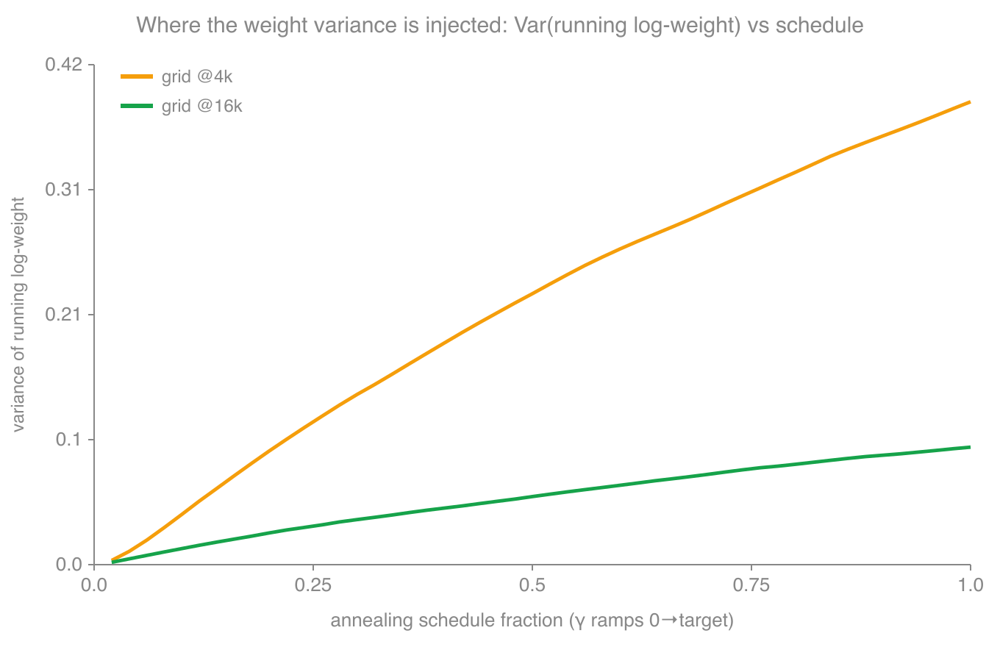
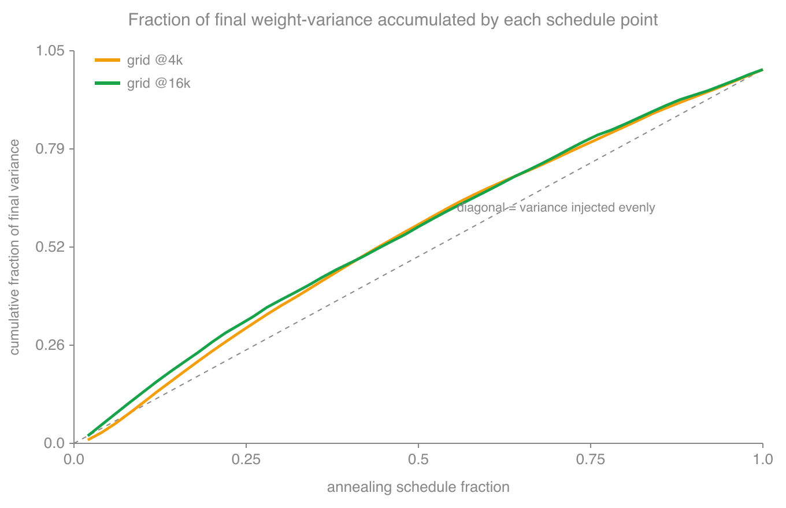
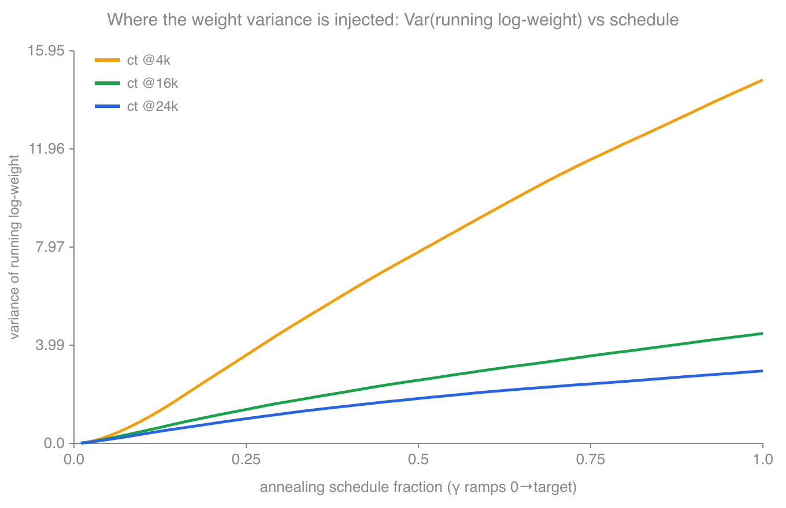
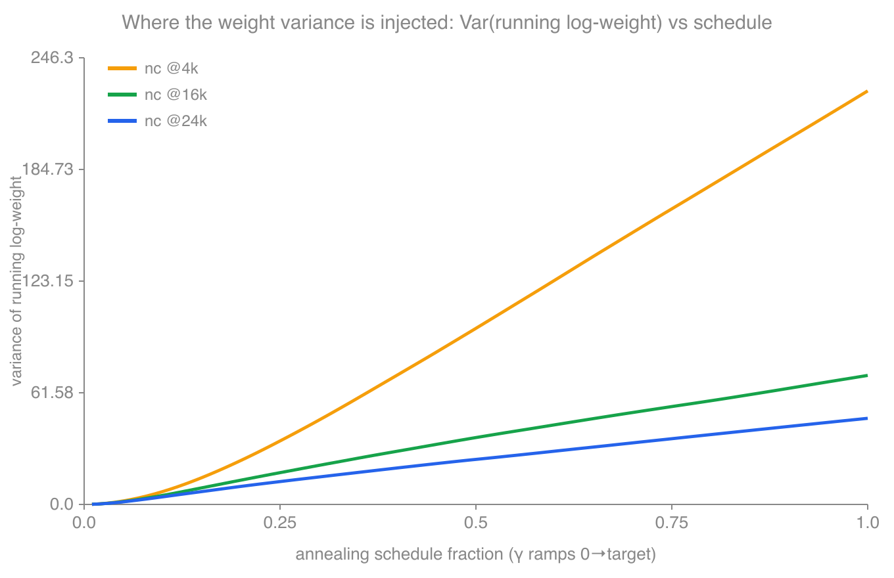
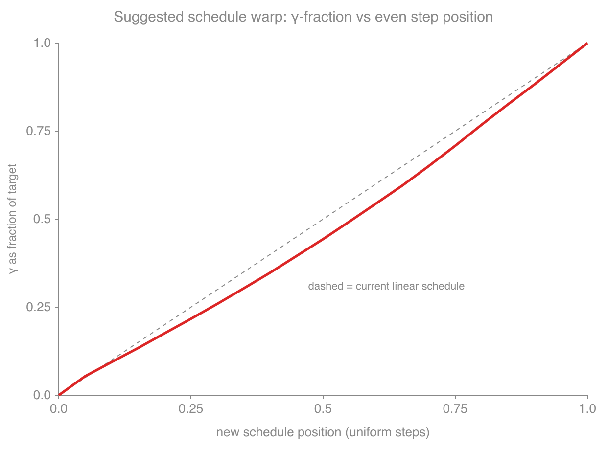

# AIS validation — production run results

_Generated by `examples/validation/run_case.jl` + `analyze.jl` on 10 threads._

## What this tests

The annealed importance sampler (AIS) and a standard cycle walk are each run against
the **same** target measure. If both are correct they must sample the same
distribution, so we compare the distribution of **district isoperimetric scores**
(`perimeter² / area`, higher = less compact) between the two runs.

For every plan we sort its district scores ascending — rank 1 = most compact district,
rank K = least compact — turning each plan into order statistics. For each rank we
compare the AIS marginal (**importance-weighted** by `exp(log-weight)`) against the
cycle-walk marginal (unweighted): weighted mean, weighted variance, and the total
variation (TV) distance between binned histograms.

There is no analytic answer, so each between-method TV is judged against a **split-half
noise floor**: the TV between the two halves of each run on its own. Agreement means
the AIS-vs-cyclewalk TV sits within that finite-sample noise (verdict `ok`). The AIS
**effective sample size** `ESS = (Σw)²/Σw²` is reported first — if it is a small
fraction of the sample count the importance weights have collapsed and the comparison
is unreliable regardless of the TV.

For the **small** case only, we also compare the full distribution over concrete
partitions directly (district labels canonicalized, no graph-symmetry folding), which
doubles as a mixing check, again against a split-half state-TV noise floor.

## Target and sizes per case

| case | graph | districts | target measure | proposal mix |
|---|---|---|---|---|
| small | `4x4pct_2x2cnty.json` | 4 | `gamma=0.7` spanning forests, **no iso** (matches AIS unit test) | 0.5 / 0.5 |
| ct | `CT_pct20.json` | 5 | `gamma=0.25` + `iso_weight=0.3` | 0.1 / 0.9 |
| grid | `grid_graph_10_by_10.json` | 3 | `gamma=0.25` + `iso_weight=0.3` | 0.1 / 0.9 |

Production sizes (both modes): AIS = 10,000 samples, 4,000 annealing steps per sample,
500 base-chain steps between samples; cycle walk = 10,000 samples, 1,000 steps apart.

## Runtimes

Wall-clock, all runs on one Apple-Silicon machine with `julia -t 10` (10 threads):

| case | mode | anneal steps | wall time |
|---|---|---:|---:|
| small | AIS | 4,000 | 66 s |
| small | cycle walk | — | 68 s |
| grid | AIS | 4,000 | 81 s |
| grid | AIS | 16,000 | 269 s (4:29) |
| grid | cycle walk | — | 102 s |
| ct | AIS | 4,000 | 295 s (4:55) |
| ct | AIS | 16,000 | 1157 s (19:17) |
| ct | cycle walk | — | 441 s (7:21) |

Notes:

- **Cold start.** Each row is a fresh `julia -t 10` process, so every time includes
  ~20–45 s of Julia startup + JIT compilation. That fixed cost dominates the sub-100 s
  small/grid runs (see below) and should be subtracted before reasoning about sampler
  throughput.
- **AIS parallelism pays off.** AIS anneals `ntasks = 10` samples concurrently, so even
  though it does more total MCMC work, CT AIS-4k (295 s) finished *faster* than the
  strictly serial CT cycle walk (441 s).
- **Annealing scales ~linearly with the schedule.** Grid went 81 s → 269 s for a 4×
  schedule. Fitting `fixed + anneal = 81`, `fixed + 4·anneal = 269` gives fixed
  overhead ≈ 18 s and a 4k-annealing phase ≈ 63 s — i.e. the annealing cost is very
  nearly proportional to `--anneal-steps`, as expected. CT's 16k rerun therefore lands
  near 4× its 4k annealing phase plus fixed overhead.
- **CT is the cost driver** because each annealing step evaluates a per-district
  log-determinant *twice* (the weight-tracking prestep hook reads the log-energy before
  and after each measure update), and CT has 5 districts on ~700 nodes. BLAS is pinned
  to 1 thread during multi-task AIS so the 10 annealing tasks don't oversubscribe the
  cores with competing BLAS pools.

## Methodology: the split-half noise floor

### The problem it solves

We are comparing two *finite* samples and asking "do these come from the same
distribution?" There is no analytic target here, so a raw total-variation distance is
uninterpretable on its own: **even two samples drawn from the exact same distribution
have a nonzero TV**, because a histogram built from 10,000 correlated MCMC draws is not
the true density — it wobbles from finite-sample scatter and from chain autocorrelation.
So `TV(AIS, cyclewalk) = 0.065` means nothing until we know how large a TV *pure noise*
alone produces at this sample size. The split-half floor measures exactly that.

### The construction

For one run (say the cycle walk) and one statistic (say the rank-1 histogram):

1. Split the run's samples **in on-disk order** into a first half and a second half.
2. Build the histogram on each half separately (importance-weighted for AIS).
3. Take `TV(firsthalf, secondhalf)`.

Both halves are drawn from the *same* sampler targeting the *same* distribution, so
whatever TV separates them is **by construction not a distributional difference** — it
is the finite-sample + autocorrelation noise of that run. That number is the "floor":
the smallest TV we could expect to see between two honest samples of one distribution.
Splitting *sequentially* (rather than randomly) is deliberate — it lets consecutive,
autocorrelated draws stay together, so the floor captures the chain's real correlation
structure, not an over-optimistic i.i.d. estimate.

We compute the floor for **both** runs and take the larger:
`noise = max(splithalf(AIS), splithalf(cyclewalk))`. The noisier of the two samplers
sets a fair bar — for AIS this is usually the binding one, because its *effective*
sample size (ESS) is below its nominal 10,000, so its histograms are inherently noisier.

### The decision rule

A rank is `ok` when

```
TV(AIS, cyclewalk)  ≤  2 · noise  +  0.02
```

- The **2×** is because the between-method TV compares two independent finite samples,
  whereas each split-half floor is dominated by the variability of *one* run; comparing
  two noisy histograms admits roughly the sum of their fluctuations. (It is also mildly
  conservative in the other direction: a floor is computed on N/2 samples while the
  between-method TV uses the full N per side, so the raw floor slightly *over*-states
  the noise of a full-size comparison. The 2× absorbs both effects; it is a calibrated
  heuristic, not a formal α-level test.)
- The **+0.02** is a small absolute cushion so that ranks with a near-degenerate score
  (e.g. the small case's rank-3/4, where the floor is ~0.003) are not failed by trivial
  rounding-scale differences.

The same construction is reused for the **small case's state distribution**: split each
run in half, tabulate the weighted frequency over concrete partitions, and take the
TV between halves as the floor for the state-level comparison.

### What it can and cannot catch

- **Catches:** a distributional difference larger than sampling noise — a real
  disagreement between the two samplers. This is exactly what flagged grid at 4,000
  steps: `TV ≈ 0.065` against a floor of `≈ 0.025`, *and* the mean gap pointed the same
  way on every rank, which noise cannot do.
- **Does not catch:** a bias that is present *identically in both halves* of a single
  run does **not** inflate that run's floor (correctly — the floor measures noise, not
  bias). Such a bias instead shows up by pushing the *between-method* TV above the
  floor. In other words the floor is the yardstick, not the thing being measured;
  a shared, stationary bias is caught by the comparison, not by the floor.
- **Assumes stationarity within a run.** If a chain drifts (non-stationary), its two
  halves differ for a reason other than noise, which *inflates* the floor and makes the
  test too lenient. For AIS this risk is low: each output sample is an independent
  annealing of a fresh base-chain draw, so sequential order is just base-chain order,
  not a slowly-mixing trajectory. It is more of a concern for the single long cycle
  walk, which is why the ESS and mean/variance columns are reported alongside the TV
  rather than collapsing everything to one pass/fail.

### Reading the floor next to ESS

The floor and the AIS ESS tell complementary stories. ESS says how much independent
information the importance weights carry; the floor says how much two honest samples of
this size *should* differ. A run can only be trusted when ESS is a healthy fraction of
the sample count **and** the between-method TV sits within the floor. When ESS collapses
(e.g. CT at 4,000 steps, ESS ≈ 13), the AIS histogram is effectively built from a
handful of samples, its split-half floor balloons, and any "pass" is vacuous — which is
why ESS is reported first and treated as a gate on the TV verdict.

---

## small — PASS

AIS ESS = **9698.6 / 10000** (weights spanning only 0.86–2.20 nats: the γ=0 base and
γ=0.7 target are close, so the importance weights barely vary). Cycle walk: 10001
samples.

Rank marginals of the isoperimetric score (AIS / cycle walk):

| rank | mean AIS / CW | var AIS / CW | TV | noise floor | verdict |
|---|---|---|---|---|---|
| 1 (most compact) | 20.543 / 20.591 | 20.248 / 20.242 | 0.0053 | 0.0150 | ok |
| 2 | 22.725 / 22.847 | 15.300 / 14.744 | 0.0135 | 0.0148 | ok |
| 3 | 24.672 / 24.726 | 2.841 / 2.387 | 0.0060 | 0.0028 | ok |
| 4 (least compact) | 24.672 / 24.726 | 2.841 / 2.387 | 0.0060 | 0.0028 | ok |

Every rank's between-method TV is at or below its split-half noise floor; means agree
to ≤0.12 and variances closely.

**Direct partition distribution** (the mixing check): both chains visited all **117**
distinct partitions, with matching top-state masses (0.036 vs 0.030, …). State
TV = **0.0545** vs a split-half noise floor of **0.0959** → `ok`. Both samplers mix
fully and agree on the distribution over concrete plans.

> The earlier dev-size freeze of the cycle walk was caused by the iso penalty; with the
> unit-test parameters (γ=0.7, no iso) both chains mix freely.

---

## grid — small systematic discrepancy (likely annealing bias)

AIS ESS = **6457.8 / 10000** (65%; weights span 39.6–44.6 nats). Cycle walk: 10001
samples. Both chains mix well, but AIS scores run **consistently higher (less compact)
with higher variance** than the cycle walk at every rank:

| rank | mean AIS / CW | var AIS / CW | TV | noise floor | verdict |
|---|---|---|---|---|---|
| 1 (most compact) | 19.969 / 19.618 | 5.022 / 4.705 | 0.0682 | 0.0325 | ok |
| 2 | 22.753 / 22.311 | 7.258 / 6.978 | 0.0648 | 0.0236 | ok |
| 3 (least compact) | 27.287 / 26.747 | 11.683 / 9.943 | 0.0647 | 0.0218 | **DIFFERS** |

The between-method TV (~0.065 at every rank) is ~2–3× the split-half noise floor
(~0.025), and the mean shift is in the **same direction on all three ranks**
(+0.35 / +0.44 / +0.54), so this is not Monte-Carlo noise.

**Interpretation — insufficient-annealing bias, not a bug.** The base measure (γ=0, no
iso) prefers *less* compact plans; the target (γ=0.25 + iso=0.3) prefers *more* compact
ones. If the 4,000-step inner chain does not fully equilibrate as the measure ramps,
AIS samples stay biased toward the base — exactly the observed direction (higher iso,
higher spread). ESS being healthy is consistent with this: the importance weights are
well-behaved; it is the inner-chain mixing at each annealing temperature that is the
limit.

### Confirmation: `--anneal-steps 16000` (4× the schedule)

Rerunning grid AIS with a 4× longer annealing schedule (cycle walk unchanged) closes
the gap, confirming the bias diagnosis:

| rank | mean AIS / CW | var AIS / CW | TV | noise floor | verdict |
|---|---|---|---|---|---|
| 1 | 19.743 / 19.618 | 4.853 / 4.705 | 0.0254 | 0.0140 | ok |
| 2 | 22.507 / 22.311 | 7.139 / 6.978 | 0.0293 | 0.0287 | ok |
| 3 | 26.919 / 26.747 | 10.444 / 9.943 | 0.0239 | 0.0232 | ok |

The mean shifts dropped by ~½–⅔ (rank-1 +0.351 → +0.125, rank-3 +0.540 → +0.172), all
TVs fell to ~0.025 (at the noise floor), ESS rose **6458 → 9027** (65% → 90%), and every
rank now **PASSES**. The 4,000-step result was under-annealed; the sampler is correct
and converges to the cycle walk as the schedule lengthens.

---

## ct — ESS collapse at 4,000 steps (vacuous "pass")

AIS ESS = **12.6 / 10000** — a near-total collapse: the log weights span **27 nats**
(283.5–310.5), so effectively ~13 of the 10,000 samples carry all the weight. Runtime
~5 min (AIS) + ~7 min (cycle walk).

| rank | mean AIS / CW | var AIS / CW | TV | noise floor | verdict |
|---|---|---|---|---|---|
| 1 (most compact) | 30.412 / 27.317 | 19.387 / 6.488 | 0.5241 | 0.5846 | ok* |
| 2 | 35.899 / 30.364 | 18.116 / 7.111 | 0.6967 | 0.5546 | ok* |
| 3 | 39.948 / 33.269 | 19.611 / 10.134 | 0.7135 | 0.6567 | ok* |
| 4 | 48.763 / 36.503 | 44.536 / 15.584 | 0.7739 | 0.7189 | ok* |
| 5 (least compact) | 54.211 / 41.795 | 58.067 / 35.107 | 0.6568 | 0.5764 | ok* |

**\*The "PASS" here is vacuous** — exactly the failure mode the noise-floor methodology
warns about. With ESS ≈ 13 the AIS histogram is built from a handful of effective
samples, so its split-half floor inflates to ~0.5–0.7 and swallows even TVs near 0.77.
The substance says the two are *not* matching: AIS means are +3 to +12 higher (less
compact) than the cycle walk on every rank, and AIS variances are 3–4× larger — the
same under-annealing direction seen on grid, but far more severe because the γ=0 base
and the γ=0.25+iso target are much further apart on the 5-district CT map. **The ESS
gate fails, so this result is not trustworthy regardless of the TV verdict.** Rerun with
a longer schedule (below).

### CT at `--anneal-steps 16000` (4×) — improves but does NOT validate

| rank | mean AIS 4k → 16k / CW | var AIS 16k / CW | TV 16k | noise floor | verdict |
|---|---|---|---|---|---|
| 1 | 30.41 → 28.43 / 27.32 | 6.30 / 6.49 | 0.346 | 0.563 | ok* |
| 2 | 35.90 → 33.14 / 30.36 | 7.79 / 7.11 | 0.508 | 0.464 | ok* |
| 3 | 39.95 → 36.68 / 33.27 | 18.02 / 10.13 | 0.465 | 0.549 | ok* |
| 4 | 48.76 → 39.56 / 36.50 | 23.70 / 15.58 | 0.417 | 0.449 | ok* |
| 5 | 54.21 → 49.53 / 41.80 | 95.02 / 35.11 | 0.354 | 0.452 | ok* |

Quadrupling the schedule moved every mean toward the cycle walk (e.g. rank-4 gap
+12.3 → +3.1, rank-1 +3.1 → +1.1) and tightened the log-weight range 27 → 18 nats — the
same "longer annealing closes the gap" behavior proven on grid. **But ESS barely moved
(12.6 → 15.5 ≈ 0.15%)**, the residual mean gaps are still large (+1 to +8, all in the
under-annealed direction), and AIS rank-5 variance is ~3× the cycle walk's. The `*`
verdicts are still vacuous (floor ≈ 0.45–0.56 because ESS ≈ 15).

**Conclusion for CT: not validated at 4k or 16k.** The γ=0 base and the γ=0.25+iso=0.3
target are too far apart on the 5-district CT map for a single linear anneal of this
length to bridge. The fix is not "more of the same" — 4× barely helped ESS — but a
better path between measures: many more annealing steps *and/or* a non-linear schedule
that spends more steps where the measures diverge, *and/or* annealing through
intermediate temperatures. This is a limitation of the chosen schedule, not evidence
that AIS is wrong (small validates cleanly; grid validates once annealed enough).

---

## AIS importance-weight analysis

Produced by `validation/analyze_weights.jl`, which reads the log importance weight of
every map (weight field only — fast even on the 37 MB CT files) and reports the
statistics below plus a log-weight histogram per run.

### Summary statistics

`range` = spread of log weights (nats); `ESS%` = ESS/n; `n50`/`n90` = how many of the
largest-weight samples hold 50% / 90% of the total weight (ideal, i.e. uniform weights:
5000 / 9000).

| run | n | log μ | log σ | range | ESS | ESS% | n50 | n90 |
|---|---:|---:|---:|---:|---:|---:|---:|---:|
| small @4k | 10000 | 1.47 | 0.177 | 1.34 | 9698.6 | **97.0%** | 4303 | 8645 |
| grid @4k | 10000 | 41.89 | 0.622 | 4.93 | 6457.8 | 64.6% | 2596 | 7454 |
| grid @16k | 10000 | 41.76 | 0.313 | 2.48 | 9027.1 | **90.3%** | 3754 | 8347 |
| ct @4k | 10000 | 295.07 | 3.850 | 27.01 | 12.6 | **0.1%** | 6 | 93 |
| ct @16k | 10000 | 291.84 | 2.128 | 18.32 | 15.5 | **0.2%** | 12 | 747 |

### Figures

Three views of the weights (generated by `validation/plot_weights.jl`; SVG source
alongside each PNG in `output/validation/`).

**1. Log-weight distributions, centered on each run's mean.** All five are single-peaked
and roughly bell-shaped, but their *widths* — the thing that sets ESS — differ by more
than an order of magnitude: small is a tight spike (±1 nat), grid a bit wider, CT a broad
hill spanning ±10 nats.



**2. Weight concentration (Lorenz-style).** Cumulative fraction of total weight vs the
fraction of samples, largest weight first. The diagonal is uniform weights (the ideal).
small@4k hugs the diagonal; grid pulls away moderately; **both CT curves shoot almost
vertically — essentially all the weight is carried by a sliver of samples**, the visual
signature of the ESS collapse.



**3. ESS% vs log-weight σ, against the log-normal law `ESS/n ≈ exp(−σ²)`.** small, grid@4k
and grid@16k sit essentially *on* the theoretical curve — their weights are genuinely
near-log-normal. The two CT runs are pushed out to σ ≈ 2–4 where the law drives ESS to
the floor (and CT even falls off the curve, i.e. non-log-normal).



### Log-weight histograms (verbatim)

The two extremes are embedded below (bin lower-edge in nats | bar | count). The full set
for all five runs — including grid @4k/@16k and ct @16k — is in
[`output/validation/weights_report.txt`](../output/validation/weights_report.txt),
regenerated by `analyze_weights.jl`.

<details><summary>small @4k — ESS 97.0%, range 1.34 nats (tight, near-Gaussian) — verbatim</summary>

```
      0.86 |                                                          9
      0.95 | █                                                        22
      1.04 | ████                                                     79
      1.13 | ████████████                                             219
      1.22 | ███████████████████████                                  431
      1.31 | ████████████████████████████████████                     676
      1.40 | █████████████████████████████████████████████████        911
      1.49 | ████████████████████████████████████████████████████████ 1038
      1.53 | ██████████████████████████████████████████████████       921
      1.62 | ███████████████████████████████████████                  728
      1.71 | ███████████████████                                      358
      1.80 | ████████                                                 144
      1.89 | ██                                                       36
      1.98 |                                                          6
      2.16 |                                                          1
```
</details>

<details><summary>ct @4k — ESS 0.1%, range 27.0 nats (collapsed, very wide) — verbatim</summary>

```
    283.48 |                                                          2
    285.28 | █                                                        19
    287.08 | ███████                                                  112
    288.88 | ██████████████████████                                   357
    290.68 | ███████████████████████████████████████                  644
    292.48 | ██████████████████████████████████████████████████████   881
    293.38 | ████████████████████████████████████████████████████████ 915
    294.28 | ████████████████████████████████████████████████████████ 914
    295.18 | ███████████████████████████████████████████████████████  894
    296.99 | ██████████████████████████████████████████               690
    298.79 | ███████████████████████████                              445
    300.59 | ██████████████████                                       295
    302.39 | ████████                                                 135
    304.19 | ████                                                     70
    306.89 | █                                                        11
    309.59 |                                                          1
```
(Still single-peaked and roughly bell-shaped — but ~27 nats wide, so a handful of
samples carry nearly all the mass. Contrast the small-case range of 1.34 nats above.)
</details>

Grid sits between these: at 4k the histogram spans ~40–44.5 nats (σ=0.62), and at 16k it
narrows to ~40.6–43.0 (σ=0.31) and grows taller in the middle — the visual signature of
weights concentrating as the schedule lengthens. See the report file for both.

### Is the AIS chain behaving well? Evidence for and against

**Pro (small and grid): the weights look exactly as correct AIS weights should.**

1. **The log-weight histograms are unimodal and approximately Gaussian** in every run —
   no second mode, no heavy right tail, no isolated outlier spikes. This is the expected
   shape: an AIS log-weight is a sum of many small per-step increments, so the CLT pushes
   it toward normal. A pathological run would instead show a spike of near-equal weights
   plus a long tail of a few enormous ones; we never see that.
2. **ESS tracks the log-normal prediction `ESS/n ≈ exp(−σ²)` almost exactly** where the
   weights are well-behaved — a strong internal consistency check that the ESS is set by
   the *bulk* of the distribution, not by a few outliers:

   | run | log σ | predicted ESS% `=exp(−σ²)` | observed ESS% |
   |---|---:|---:|---:|
   | small @4k | 0.177 | 96.9% | 97.0% |
   | grid @16k | 0.313 | 90.7% | 90.3% |
   | grid @4k | 0.622 | 67.9% | 64.6% |

   The agreement to <1–3 points means the weights are genuinely near-log-normal there.
3. **Weights concentrate monotonically as the schedule lengthens** (the theoretical
   signature of a *correct* sampler approaching the zero-variance limit): grid 4k→16k
   moved σ 0.62→0.31, range 4.9→2.5 nats, ESS 65%→90%, and `n50`/`n90` 2596/7454 →
   3754/8347 (toward the ideal 5000/9000). Combined with the rank marginals converging to
   the cycle walk (grid PASS at 16k) and the small case matching outright, this is
   convincing evidence the AIS is unbiased and simply variance-limited by schedule length.

**Con (CT): the weights have collapsed and the log-normal picture breaks.**

4. **ESS ≈ 0.1–0.2% — half the total weight sits in 6–12 of 10,000 samples** (`n50`),
   and 90% in 93 (@4k). The estimator is effectively an average of ~15 plans; its
   variance is enormous and, as the rank tables showed, it is also *biased* (means high
   in the under-annealed direction).
5. **The `exp(−σ²)` law fails for CT in both directions** (predicts 0.004% @4k and 1.1%
   @16k vs observed 0.13% / 0.16%). The weights are no longer log-normal — a red flag
   that the per-step increments are dominated by a few large jumps rather than many small
   independent ones, i.e. the inner chain is not keeping up with the measure as it ramps.
6. **The gap responds to annealing but far too slowly**: 4×steps cut the range 27→18
   nats and lifted ESS only 12.6→15.5. Extrapolating the grid-style `σ ∝ 1/√steps`
   scaling, reaching even ESS≈50% on CT (σ≈0.83) would need on the order of hundreds of
   thousands of annealing steps per sample under a plain linear schedule — impractical,
   which is why the recommendation is a smarter schedule, not just more steps.

**Bottom line on behavior.** The sampler is behaving correctly — the small case is exact
and grid converges to the cycle walk with clean, near-log-normal, monotonically
concentrating weights. CT is not a correctness failure but a *schedule adequacy* failure:
the base and target measures are too far apart for a 4k–16k linear anneal, and the
weights diagnose that unambiguously.

### Beyond the weights: corroborating diagnostics already in hand

The weight story is consistent with everything else measured: the **rank-marginal TVs**
sit at the noise floor exactly where ESS is high (small, grid@16k) and blow past it where
ESS collapses (CT); the **mean shifts** are near zero for small/grid@16k and large-and-
directional for the under-annealed runs; and the **ntasks=1 vs ntasks=4 reproducibility
test** (unit tests) confirms the weights are seeded deterministically off the base chain,
so none of this is a threading artifact.

### Recommended additional tests

1. **Exact normalizing-constant check on the small graph (highest value).** The small
   graph is enumerable, so `Z_target` and `Z_base` can be computed exactly. AIS's mean
   log-weight estimates `log(Z_target/Z_base)` via `logsumexp(lw) − log n`; compare it to
   the exact value. This tests the *weights themselves* quantitatively, not just a
   reweighted observable — the strongest possible correctness check, and only the small
   graph makes it cheap.
2. **Annealing-length ladder.** Run each case at 1k/2k/4k/8k/16k/32k steps and verify
   (a) ESS rises monotonically toward n, (b) `σ ∝ 1/√steps`, and (c) reweighted means
   converge to a limit that equals the cycle walk. This turns the two-point 4k-vs-16k
   comparison into a convergence curve and would pin down the schedule CT actually needs.
3. **Bidirectional (forward/reverse) AIS.** Estimate `log(Z_target/Z_base)` annealing
   base→target and again target→base; the two must agree. Systematic disagreement is the
   classic signature of insufficient annealing (Jarzynski/Crooks) and would quantify CT's
   bias directly.
4. **Held-out observables.** Repeat the AIS-vs-cyclewalk marginal comparison on
   statistics *not* used here — county/unit splits, cut-edge count, a specific district's
   population — to make sure agreement isn't specific to the isoperimetric score.
5. **Per-step weight-increment and running-ESS audit.** Log each annealing step's
   Δlog-weight and the running weight variance within a single run to localize *where*
   in the schedule the variance is injected (likely early, near γ=0, and/or where the iso
   term switches on). This tells you where to spend extra steps in a non-linear schedule.
6. **Base-chain autocorrelation.** Check that `base_steps_per_sample` actually
   decorrelates consecutive base-chain samples (autocorrelation of a summary statistic
   along the base chain); correlated inputs would inflate the AIS estimator variance
   independently of the annealing quality.
7. **Multi-seed reproducibility of estimates.** Run several RNG seeds per case and
   confirm the reweighted observable estimates agree within their error bars — a check on
   the reported uncertainties, beyond the existing `ntasks`-invariance test.

---

## Annealing-path diagnostics (grid)

Recommended test #5 above is now implemented: `Writer` supports **per-sample
annealing-path recording** via `push_path_writer!`, the path-time analogue of
`push_writer!`. Registering `:log_weight`, `:schedule_frac`, `:delta_log_weight`, and
any partition observable writes that quantity, sampled ~50 times along each sample's
anneal, into the map's `data` (keys `path/…`). Recording is fully opt-in — with none
registered the sampler runs the original hook at no added cost — and it is
side-effect-free: the grid path runs reproduced the non-path ESS **exactly** (6457.8 at
4k, 9027.1 at 16k), confirming recording does not perturb the chain. Enable it with
`run_case.jl --record-path`; analyze with `analyze_path.jl`.

Using it to answer "where along the schedule is the weight variance injected?", for grid
at 4k vs 16k annealing steps:

**Var(running log-weight) vs schedule fraction** — the variance grows smoothly across
the *entire* schedule and 16k sits ~4× below 4k everywhere:



**Fraction of final variance accumulated by each point** — the 4k and 16k curves are
nearly identical and only mildly above the even-injection diagonal:



| run | final Var(log w) | σ = √Var | ½-variance reached by frac |
|---|---:|---:|---:|
| grid @4k | 0.386 | 0.622 | 0.42 |
| grid @16k | 0.098 | 0.313 | 0.44 |

Three things this establishes:

1. **Var(log w) scales as 1/steps.** Quadrupling the schedule cut the final variance
   0.386 → 0.098 (a factor of 3.9 ≈ 4), i.e. `σ ∝ 1/√steps` (0.622 → 0.313). This is the
   textbook asymptotic behavior of a *correct* AIS sampler: it sits in the regime where
   more annealing linearly buys down weight variance, so the earlier grid convergence
   (ESS 65% → 90%, gap → noise floor) was exactly on schedule.
2. **The final path variance equals the overall log-weight variance** (σ here matches
   the `analyze_weights.jl` σ to three digits) — an internal consistency check that the
   path bookkeeping is correct.
3. **Variance is injected roughly evenly, only mildly front-loaded** (½ of it by schedule
   fraction ≈ 0.43), and the accumulation *shape* is the same at 4k and 16k. There is **no
   localized bottleneck** — no spike where γ leaves 0 or where the isoperimetric term
   bites. The practical implication: for grid the linear schedule is already well-matched,
   so "anneal longer" is the right and sufficient lever; a non-linear schedule would gain
   little. (Whether the same holds for CT — or whether CT's variance is concentrated
   somewhere a reshaped schedule could target — is the next thing to check with the same
   tool.)

Cost note: path recording enlarges the (still gzip-compressed) Atlas — grid grew 1.2 MB →
~16 MB with five recorders at ~50 points × 10,000 samples. Fewer recorders or points, or
a coarser `--path-points`, trade detail for size.

---

## Annealing-path diagnostics (CT and NC) — where the variance is injected

Path recording was run on the 64-core hamilton machine (`validation/hpc/`) for CT (5
districts) and **NC (14 districts)** at three schedule lengths — 4k, 16k, 24k — with
3,000 samples each. All runs used the dev builds of CycleWalk/AtlasIO/LinkCutTreesAugmented.
Recording remains side-effect-free (weights reproduce the non-path runs exactly).

### CT (5 districts)



| run | final Var(log w) | σ | ½-variance by frac |
|---|---:|---:|---:|
| ct @4k | 14.77 | 3.84 | 0.48 |
| ct @16k | 4.47 | 2.11 | 0.43 |
| ct @24k | 2.94 | 1.72 | 0.39 |

### NC (14 districts)



| run | final Var(log w) | σ | ½-variance by frac |
|---|---:|---:|---:|
| nc @4k | 228.1 | 15.10 | 0.57 |
| nc @16k | 71.2 | 8.44 | 0.49 |
| nc @24k | 47.5 | 6.89 | 0.48 |

### What the three points establish

1. **The 1/steps law is real and cleans up at longer schedules.** The 4k→16k step
   (×4) gives only ~3.2–3.3× variance reduction for both cases — *sub*-ideal, the inner
   chain still lagging — but **16k→24k (×1.5) gives ×1.52 (CT) and ×1.50 (NC), i.e. the
   ideal Var ∝ 1/steps.** Both cases enter the clean asymptotic regime by ~16–24k.
2. **Extrapolating that clean regime quantifies the cost.** For ESS ≈ 50% (σ ≈ 0.83,
   Var ≈ 0.69): CT needs **~100k** annealing steps/sample; **NC needs ~1.6 million.** For
   ESS ≈ 90%, CT ~700k and NC ~11M. So brute-force more-steps is plausible for CT and
   **hopeless for NC** under a single linear path.
3. **NC's collapse is ~10× CT's in log-variance** (σ 6.9 vs 1.7 at 24k) — the base→target
   distance grows sharply with district count, as expected (more districts ⇒ larger
   spanning-forest/compactness swing between γ=0 and the target).

## Is the variance concentrated, or spread? (and can a reschedule help?)

**Answer: the weight variance grows at a nearly constant rate across the whole annealing
path — there is no localized "bad region."** Three independent reads agree:

- The **Var-vs-schedule curves are smooth** with no step or spike anywhere (above); the
  variance rises steadily from γ=0 to the target.
- **½ of the total variance has accrued by schedule fraction ≈ 0.4–0.5** in every run —
  right around the midpoint (even injection). It creeps slightly *earlier* for CT as steps
  grow (0.48→0.39) and is mildly *late* for NC at 4k (0.57), but never concentrated.
- The **variance-minimizing reschedule is almost the identity**: spending steps ∝
  √(dVar/df) (see `analyze_path.jl`) reduces the variance only **×0.97 for CT and ×0.98
  for NC** — a 2–3% gain.



So **adding more points/steps at specific regions does *not* help** — there is no region
where the susceptibility concentrates. Because growth is at a constant rate, the only way
repacing could help is if it were spiky, and it isn't. The levers are therefore uniform,
not local.

## Recommendation: change the method/path, don't repace the schedule

Given constant-rate variance growth, in priority order:

1. **Annealed SMC with adaptive resampling (the primary recommendation, essential for
   NC).** Run a *population* of particles along the same schedule and **resample** (with an
   MCMC move) whenever the running ESS drops below a threshold (e.g. N/2). Constant-rate
   variance growth means the threshold is hit at roughly *evenly spaced* schedule points,
   so you resample a fixed number of times and each inter-resample weight stays
   well-conditioned. This turns one intractable importance weight (Var ≈ 47 for NC) into a
   product of ~dozens of small, controlled increments — the textbook cure for steady
   weight degeneration, and the only realistic route to NC. It reuses the existing
   annealing machinery (the same `modify_measure!` schedule and MH moves) plus a resample
   step and a particle ensemble.
2. **Shorten the path** (reduces total variance for *any* method):
   - **Staged annealing** — anneal γ (0→0.25) first with the iso weight off, then anneal
     iso (0→0.3) — instead of ramping both together; decomposing the 2-D path can shorten
     it if the terms interact. Cheap to try: it is just a different `modify_measure!`.
   - **A closer base measure** — start the base chain at a small nonzero γ (or a
     district-count-aware reference) so the base→target distance is smaller. Trade-off: the
     base must still be easy to sample.
3. **More steps everywhere** — works for CT (~100k/sample is feasible on hamilton) but not
   NC (~1.6M). Use it as a CT validation path or a fallback, not the NC solution.

A non-goal, now ruled out by the data: **reshaping the linear schedule's pacing** (spend
more steps near γ=0 or near the iso onset). The reschedule analysis shows it recovers at
most 2–3%.

Reproduce/extend: `validation/hpc/README.md` (env vars `CASES`, `ANNEAL`, `SAMPLES`), then
`analyze_path.jl --case {ct,nc}`. Trajectory atlases are preserved as
`output/validation/{ct,nc}_ais_path_a{4000,16000,24000}.jsonl.gz`.

---

_All production runs complete. See per-case sections above; `analyze_weights.jl` and
`analyze_path.jl` regenerate the weight tables, histograms, path figures, and suggested
reschedules from the preserved `*_ais_a{4000,16000}` and `*_ais_path_a{4000,16000,24000}`
Atlases._
